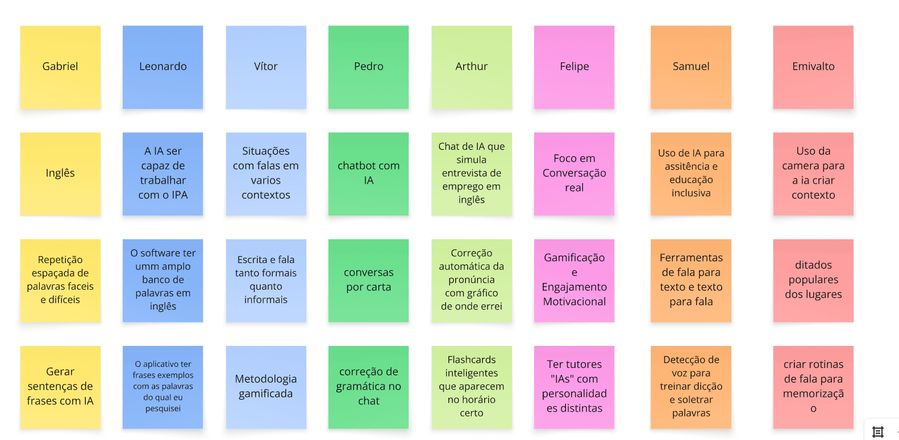
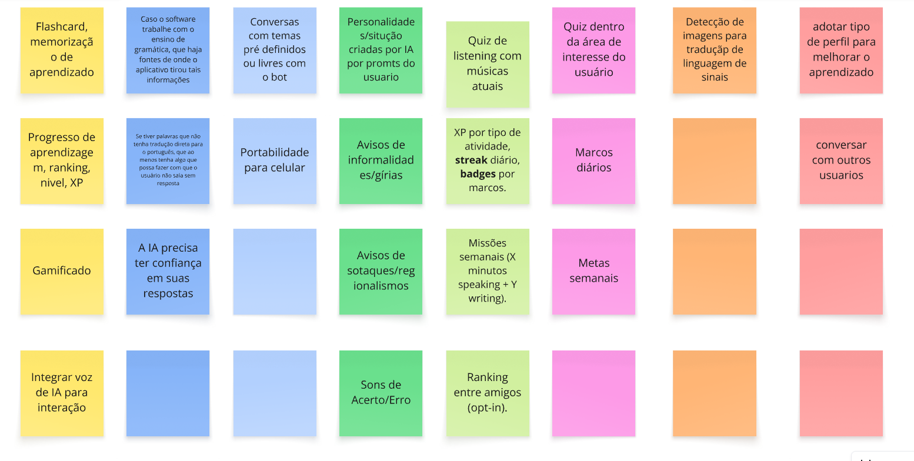
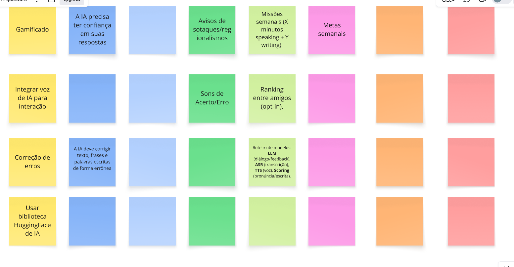
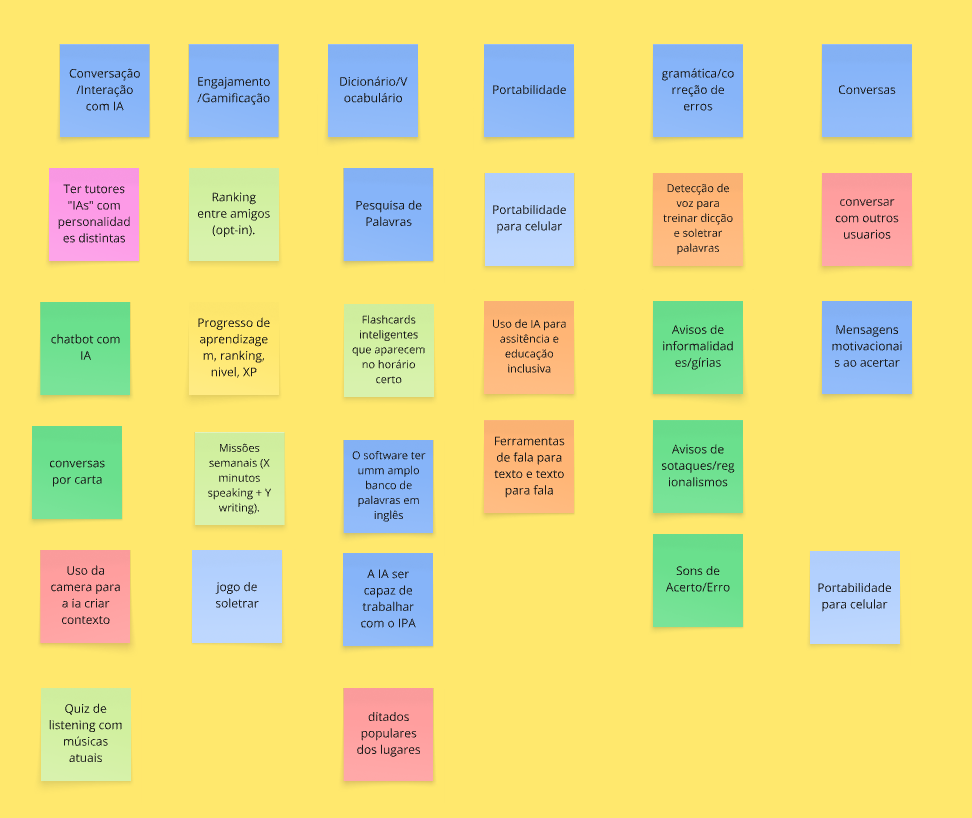

# Brainstorming

---

## Sumário

- [Técnica Utilizada](#Técnica-Utilizada)
- [Objetivos](#Objetivos)
- [Bibliografia](#bibliografia)
- [Histórico de Versões](#histórico-de-versões)

---

## Técnica Utilizada
Há vários métodos de se fazer brainstorm. Decidimos utilizar o brainstrom como definido no LeanInception, um brainstrom de funcionalidades.
Já tinhamos decidido que seria um aplicativo de línguas com alguma ferramenta de IA. Portanto o brainstorm de funcionalidades 
se mostrou mais útil para definir o que estariamos criando. 
Então pedimos para todos criarem 3 ou mais ideias de funcionalidades sozinhos para então juntar e compararmos nossas ideias.
O processo de juntar as ideias em uma só visão foi feita em confunto, separamos as ideias similares em colunas e ideias quase identicas foram
convergidas em uma. O intuito foi criar um esboço do projeto, já que cada ideia depois seria base para uma feature e cada coluna um épico.

   Design Sprint | Versão 1.0

## Objetivos
O objetivo foi criar uma visão do produto e um esboço dos caminhos que o projeto irá seguir. O método utilizado do Brainstorm nos deu um 
bom esboço para servir de base para os outros documentos de ideação e mapeamento de features.

## Resultado do BrainStorm
Realizamos o Brainstrom pelo Miro, o canvas completo esta disponível [aqui](https://miro.com/app/board/uXjVJNopTCE=/)

Nas ideias individuais, cada membro teve uma coluna para escrever. Segue as imagens:

Em consenso o resultado final do BrainStorm foi o seguinte:

---

## Bibliografia

> 
<small>CONTENT STUDIO. O que é um dicionário de dados? Disponível em: <a href="https://www.purestorage.com/br/knowledge/what-is-a-data-dictionary.html">https://www.purestorage.com/br/knowledge/what-is-a-data-dictionary.html</a>. Acesso em: 30 abr. 2025.</small>

<small>Lean Inception: o que é, etapas e como usar para definir seu MVP, Disponível em: <a href="https://softdesign.com.br/blog/lean-inception/#h-quando-quem-e-por-que-devemos-aplicar-uma-lean-inception">https://softdesign.com.br/blog/lean-inception/#h-quando-quem-e-por-que-devemos-aplicar-uma-lean-inception </small>

---

## Histórico de Versões

| Versão | Descrição | Autor(es) | Data de Produção | Revisor(es) | Data de Revisão | Incremento do Revisor|
| :----: | --------- | --------- | :--------------: | ----------- | :-------------: | :-------------: |
| `1.0` | Modelagem inicial | [Felipe das Neves](https://github.com/FelipeFreire-gf) | 03/09/2025 | | | |
| `1.1` | Modelagem inicial | [Pedro Cruz](https://github.com/pfc15) | 04/09/2025 | | | |