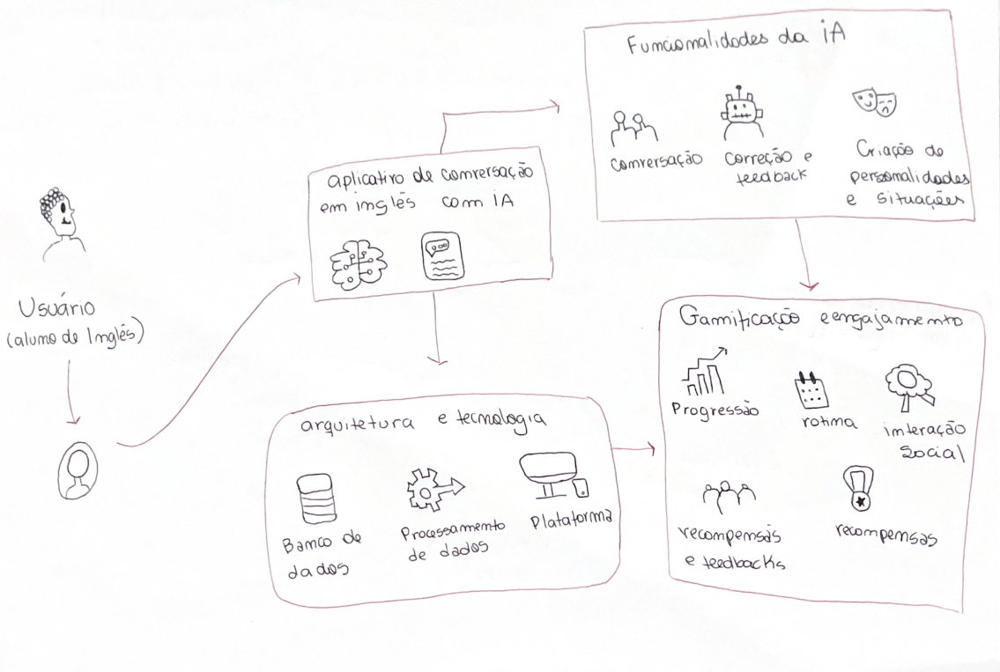
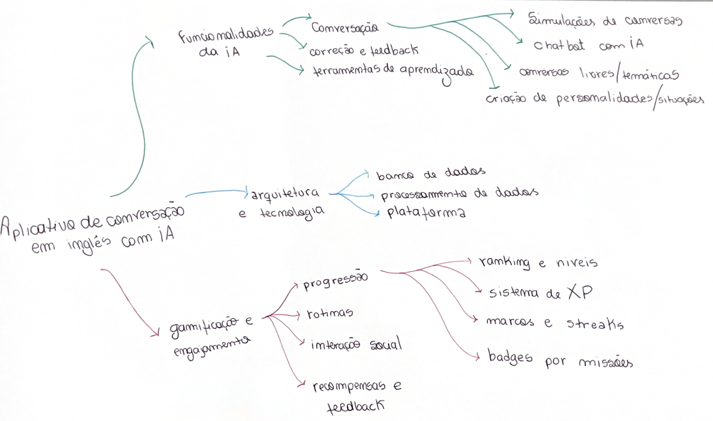

# Design Sprint Diversão

A fase de **Diversão** (ou Ideação) da Design Sprint é o momento de explorar a criatividade. Após compreender o problema, o foco agora é gerar uma ampla gama de soluções e ideias inovadoras. Nesta etapa, a equipe utiliza técnicas de rich picture ou mapa mental para pensar em conceitos que possam resolver o desafio principal, com ênfase na quantidade e originalidade das ideias.

---

## Sumário

- [Técnica Utilizada](#Técnica-Utilizada)
- [Objetivos](#Objetivos)
- [Ideação: Felipe das Neves](#ideação-felipe-das-neves)
- [Ideação: Gabriel Lima](#ideação-gabriel-lima)
- [Bibliografia](#bibliografia)
- [Histórico de Versões](#histórico-de-versões)

---

## Técnica Utilizada

Para a fase de "Diversão" da Design Sprint, foi utilizada a técnica de **Sessão de Ideação Colaborativa**. Esta técnica envolveu a equipe em um processo de brainstorming focado em gerar o maior número possível de ideias para tornar a experiência do usuário mais engajadora, divertida e motivadora. O objetivo foi explorar conceitos de gamificação, interatividade e elementos lúdicos que pudessem ser integrados ao produto.

Aqui cada integrante desenvolveu de maneira individual um rich picture ou mapa mental da sua ideia da aplicação.

## Objetivos

Os principais objetivos desta fase de "Diversão" foram:

*   **Gerar Ideias de Gamificação:** Desenvolver conceitos e funcionalidades que utilizem elementos de jogos (pontuação, níveis, desafios, recompensas) para aumentar o engajamento do usuário.
*   **Promover o Engajamento do Usuário:** Identificar maneiras de tornar o processo de aprendizagem mais cativante e menos monótono, incentivando a prática contínua.
*   **Explorar Elementos Lúdicos:** Brainstorming de recursos interativos e divertidos que possam ser incorporados à plataforma para enriquecer a experiência de aprendizado.
*   **Aumentar a Retenção de Usuários:** Criar funcionalidades que motivem os usuários a retornar e continuar utilizando o aplicativo regularmente, transformando o aprendizado em uma atividade prazerosa.
*   **Inovação na Experiência de Aprendizagem:** Pensar "fora da caixa" para propor soluções únicas que diferenciem o produto no mercado.

---

### Ideação: Felipe das Neves

Decidi fazer um rich picture da minha perspeciva do projeto:

   Rich Picture Felipe | Versão 1 
    

  

    
Autor: <a href="https://github.com/FelipeFreire-gf">Felipe das Neves</a>.

### Ideação: Gabriel Lima

Desenvolvi um rich picture da minha perspectiva do projeto e um mapa mental:

   Rich Picture Gabriel | Versão 1 
    

  

    
Autor: <a href="https://github.com/FelipeFreire-gf">Gabriel Lima</a>.

   Mapa Mental Gabriel | Versão 1 
    

  

    
Autor: <a href="https://github.com/FelipeFreire-gf">Gabriel Lima</a>.

### Ideação: Emivalto Junior

Rich Picture de uma idea de como o projeto poderia ser desenvolvido:

   Rich Picture | Versão 1 
    

  

    
Autor: <a href="https://github.com/EmivaltoJrr">Emivalto Junior</a>.

### Ideação: Vítor Bessa

Rich picture contendo a minha ideia de tutor de inglês usando IA

   Rich Picture | Versão 1 
    

  

    
Autor: <a href="https://github.com/Bessazs">Vítor Bessa</a>.

### Ideação: Mateus Bastos

Mapa mental e Rich Picture na minha concepção:

   Rich Picture | Versão 1 
    

  

    
Autor: <a href="https://github.com/Bessazs">Mateus Bastos</a>.

   Mapa Mental | Versão 1 
    

  

---

## Bibliografia

> 
<small>KNAPP, Jake; ZERATSKY, John; KOWITZ, Braden. **Sprint: O Método Usado no Google para Testar e Aplicar Novas Ideias em Apenas Cinco Dias**. Rio de Janeiro: Intrínseca, 2016.</small>

---

## Histórico de Versões

| Versão | Descrição | Autor(es) | Data de Produção | Revisor(es) | Data de Revisão | Incremento do Revisor|
| :----: | --------- | --------- | :--------------: | ----------- | :-------------: | :-----------------: |
| `1.0` | Modelagem inicial | [Felipe das Neves](https://github.com/FelipeFreire-gf) | 01/09/2025 | | | |
| `1.1` | Desenvolvimento do conteúdo sobre a técnica utilizada e os objetivos da fase de "Diversão". | [Felipe das Neves](https://github.com/FelipeFreire-gf) | 04/09/2025 | | | |
| `1.2` | Inserção dos trabalhos do Felipe e do Gabriel. | [Felipe das Neves](https://github.com/FelipeFreire-gf) | 04/09/2025 | | | |
| `1.3` | Inserção do rich picture do Emivalto Junior. | [Emivalto Junior](https://github.com/EmivaltoJrr) | 04/09/2025 | | | |
| `1.4` | Inserção do rich picture do Vítor Bessa. | [Vítor Bessa](https://github.com/Bessazs) | 04/09/2025 | | | |
| `1.5` | Realização do Mind Map | [Leonardo de Melo](https://github.com/leozinlima) | 04/09/2025 | | | |
| `1.6` | Inserção do rich picture e mapa mental de Mateus Bastos. | [Mateus Bastos](https://github.com/Bessazs) | 05/09/2025 | | | |
